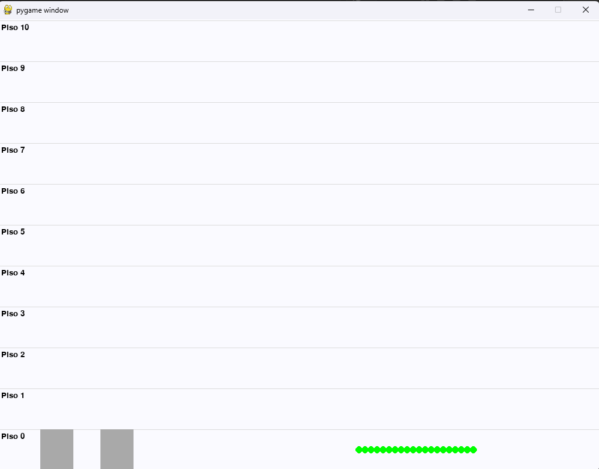
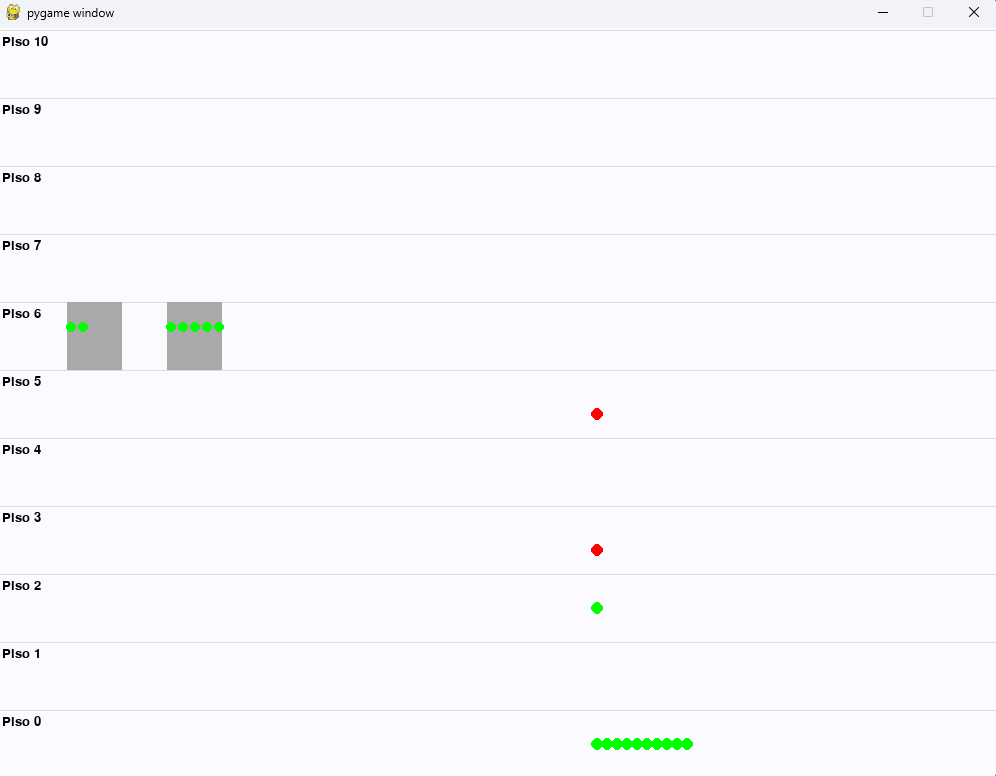
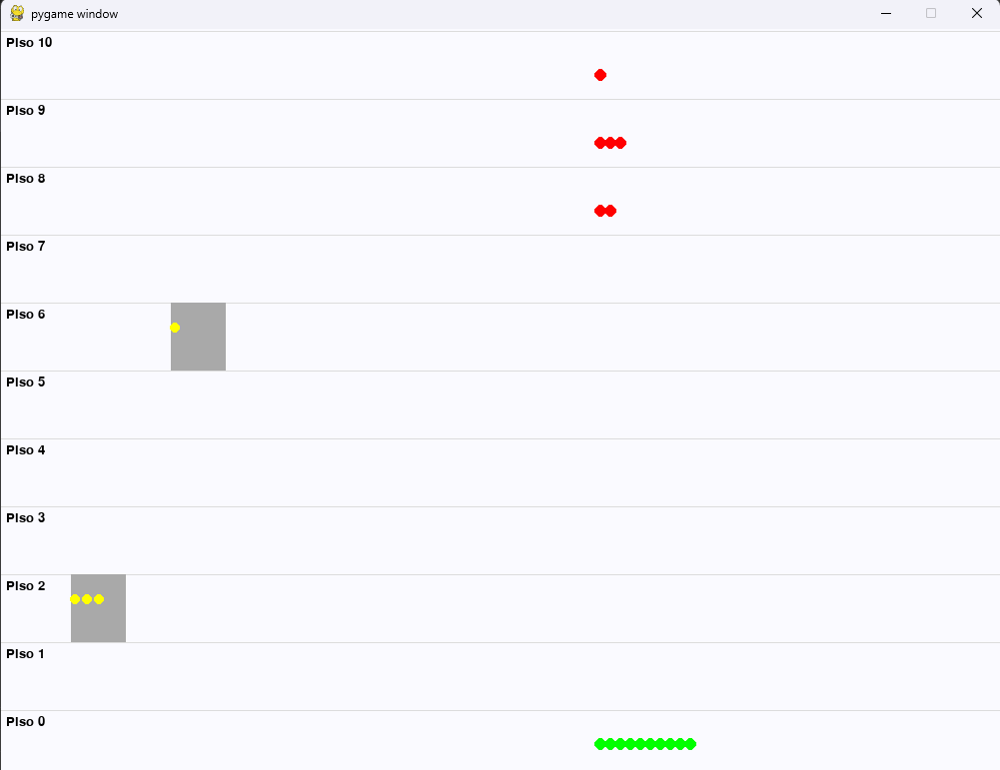
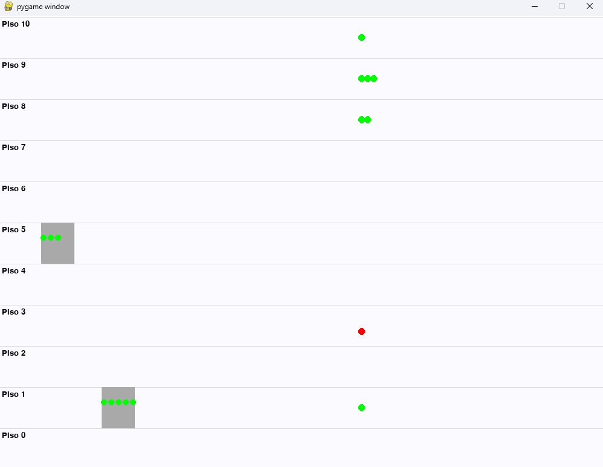

<div align="center">


<br/>


</div>

<br/>


### ▎DESCRIPCIÓN

**Elevator Simulation** es una simulación concurrente de un sistema de ascensores para un edificio de 10 pisos. Desarrollado en **Python 3** con visualización gráfica en tiempo real usando **Pygame**, aplicando conceptos de **Sistemas Operativos** como hebras y semáforos para gestionar la sincronización de los ascensores y el flujo de pasajeros.

Cada ascensor se ejecuta en su propia hebra y coordina el acceso a los recursos compartidos mediante semáforos, evitando condiciones de carrera mientras transporta pasajeros a sus destinos.

<br/>


### ▎FUNCIONALIDADES

- **Gestión de múltiples ascensores** — cantidad configurable de ascensores ejecutándose de forma concurrente en hebras independientes.
- **Sincronización con semáforos** — evita condiciones de carrera cuando múltiples ascensores acceden a los datos compartidos de los pasajeros.
- **Generación aleatoria de pasajeros** — los pasajeros reciben pisos de destino aleatorios en tiempo de ejecución.
- **Sistema de cooldown** — los pasajeros esperan en su piso antes de regresar a la planta baja.
- **Visualización en tiempo real** — ventana Pygame en vivo que muestra ascensores, pasajeros y el estado de los pisos con colores identificadores.
- **Configuración por archivo** — todos los parámetros de la simulación se cargan desde un archivo `.txt` externo.

<br/>


### ▎TECNOLOGÍAS

| Tecnología | Uso |
|---|---|
|  | Lenguaje principal |
|  | Visualización gráfica en tiempo real |
|  | Ejecución concurrente de ascensores |
|  | Sincronización de recursos compartidos |
|  | Carga de parámetros desde .txt |

<br/>


### ▎VISTA PREVIA

| Estado inicial | Ascensores subiendo |
|---|---|
|  |  |

| Pasajeros bajando | Simulación en curso |
|---|---|
|  |  |

<br/>


### ▎LEYENDA DE COLORES

| Color | Significado |
|---|---|
| 🟢 Verde | Pasajero esperando el ascensor / subiendo |
| 🟡 Amarillo | Pasajero bajando |
| 🔴 Rojo | Pasajero en cooldown (esperando en el piso) |

<br/>


### ▎ESTRUCTURA DEL PROYECTO

```
elevator-simulation/
├── main.py                  # Lógica principal de la simulación
├── datosascensores.txt      # Archivo de configuración de entrada
├── .gitignore
├── LICENSE
└── README.md
```

<br/>


### ▎ARCHIVO DE CONFIGURACIÓN

Edita `datosascensores.txt` con los parámetros de tu simulación:

```
2       ← Cantidad de ascensores
5       ← Capacidad del ascensor (máximo de pasajeros)
20      ← Total de personas
5       ← Personas generadas por ciclo
1       ← Tiempo en piso 1
2       ← Tiempo en piso 2
3       ← Tiempo en piso 3
4       ← Tiempo en piso 4
5       ← Tiempo en piso 5
6       ← Tiempo en piso 6
7       ← Tiempo en piso 7
8       ← Tiempo en piso 8
9       ← Tiempo en piso 9
10      ← Tiempo en piso 10
```

<br/>


### ▎REQUISITOS

- **Python 3.11** — [Descargar](https://www.python.org/downloads/release/python-3119/) ⚠️ Python 3.12+ aún no es compatible con Pygame
- Librería **Pygame**

<br/>


### ▎CÓMO EJECUTAR

**1. Instalar dependencias**
```bash
pip install pygame
```

**2. Ejecutar la simulación**

Linux / macOS:
```bash
python main.py
```
Windows:
```bash
py -3.11 main.py
```

<br/>


### ▎CONTEXTO ACADÉMICO

Proyecto desarrollado para el curso **Hardware y Sistemas Operativos** -INF2322- en la [Pontificia Universidad Católica de Valparaíso (PUCV)](https://www.pucv.cl), 1er semestre de Ingeniería en Informática durante el 2024.

Conceptos aplicados: programación concurrente, manejo de hebras, sincronización con semáforos, simulación gráfica en tiempo real.

<br/>


### ▎AUTOR

<div align="center">

[](https://github.com/cord0990)

</div>

<br/>


